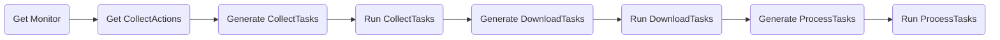
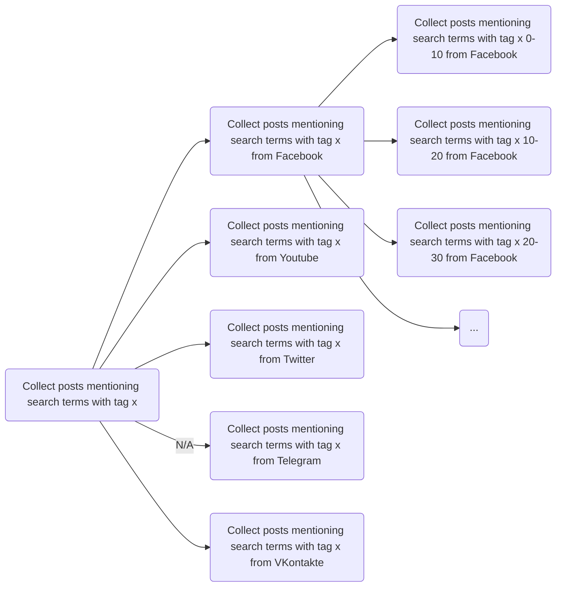
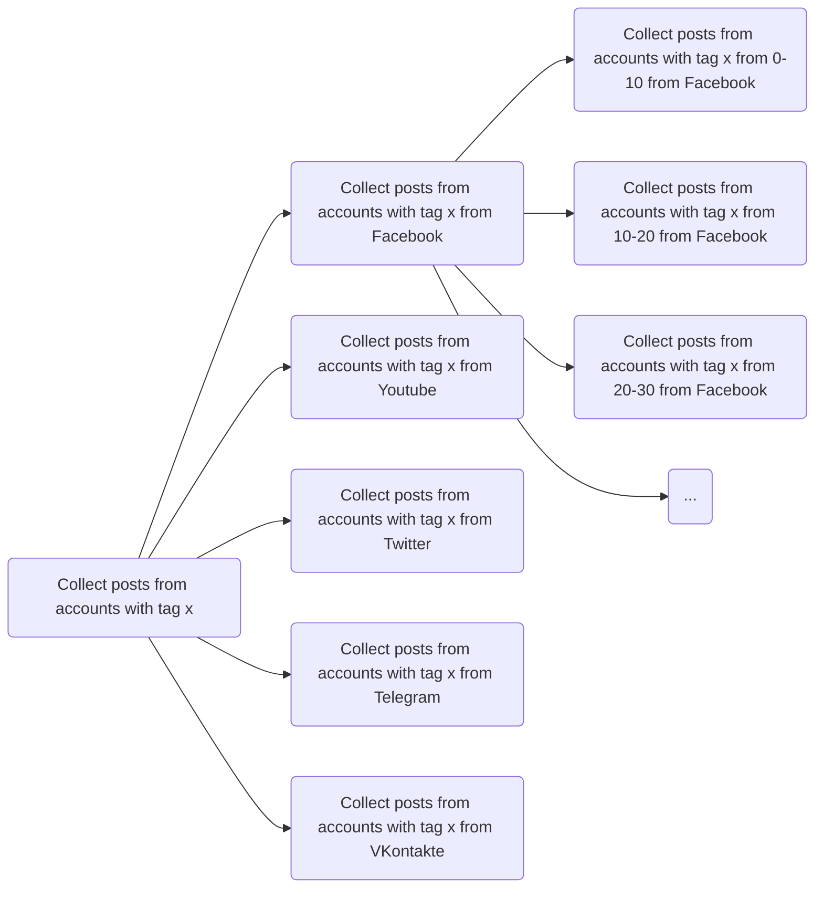

# ibex
A Celery application to collect data, download media and extract information from social media APIs.

## Requirements
You must have a Redis DB instance running (which is currently used as the Celery broker). 

You must also have a MongoDB instance running as the application's write layer.

## Usage

1. Clone teh repository
```
git clone https://github.com/ibex-app/data-collection-and-processing
```
2. Navigate to the colonned directory
```
cd data-collection-and-processing
```
3. Clone repository for models within the same direcotry
```
git clone https://github.com/ibex-app/ibex_models
```
4. pip install the requirements 
```
pip install -r requirements.txt
```
5. Set up a message redis broker for selery (wollow the instructions here https://docs.celeryq.dev/en/stable/getting-started/backends-and-brokers/redis.html#broker-redis) 

6. Run the celery worker:
```
celery -A app.core.celery.worker worker -l info
```
Note, that Celery does not support **Windows**, so you should probably include
```
--pool=solo
```
to avoid any unnecessary errors (for testing only).

7. Run data collectino process:
```
python main.py --monitor_id=XXXXXXXXXXXXXX
```


for sample data collectino add **--sample=Trye** argument:
```
python main.py --monitor_id=XXXXXXXXXXXXXX --sample=True
```


Run flower instance for interactive dashboard:
```
python celery -A app.core.celery.worker flower
```

And make sure to include 
**CROWDTANGLE_TOKEN**, 
**YOUTUBE_TOKEN**, 
**TELEGRAM_HASH**,
**TELEGRAM_ID**,
**VK_USER**,
**VK_PASS**,
and **MONGO_CS** 
as environment variables and set credentials into app/core/datasources/twitter/.twitter_keys.yaml 
file for the respective collectors to work properly.

Monitor -> CollectActions (sub-monitors) -> CollectTasks

Platform (data source)
Account (account)




### Firehose


### Curated

