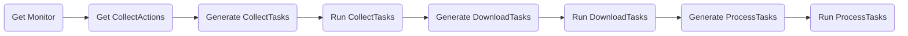

# Project IBEX
A Celery application to collect data, download media and extract information from social media APIs.

## Requirements
You must have a Redis DB instance running (which is currently used as the Celery broker). 

You must also have a MongoDB instance running as the application's write layer.

## Usage

0. Clone repository for models

```
git clone https://github.com/ibex-app/ibex_models
```

1. Run celery:
```
celery -A app.core.celery.worker worker -l info
```

Note, that Celery does not support **Windows**, so you should probably include
```
--pool=solo
```
to avoid any unnecessary errors (for testing only).

2. Run data collectino process:
```
python main.py --monitor_id=XXXXXXXXXXXXXX
```


3. Run sample data collectino process:
```
python main.py --monitor_id=XXXXXXXXXXXXXX --sample=True
```


4. Run flower instance for interactive dashboard:
```
python celery -A app.core.celery.worker flower
```

And make sure to include **CROWDTANGLE_TOKEN** and **YOUTUBE_TOKEN** 
as environment variables and set credentials into app/core/datasources/twitter/.twitter_keys.yaml 
file for the respective collectors to work properly.

Monitor -> CollectActions (sub-monitors) -> CollectTasks

Platform (data source)
DataSource (account)



